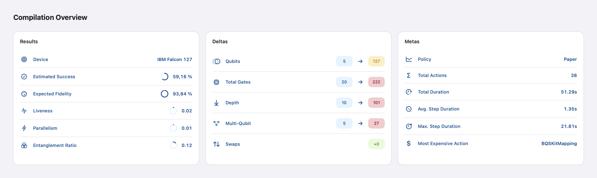
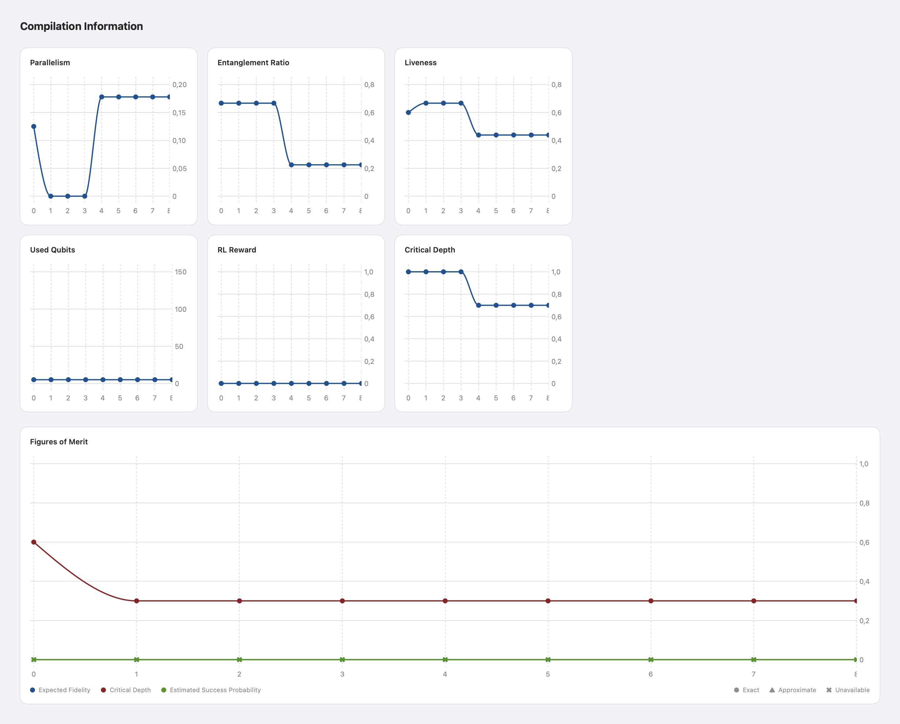
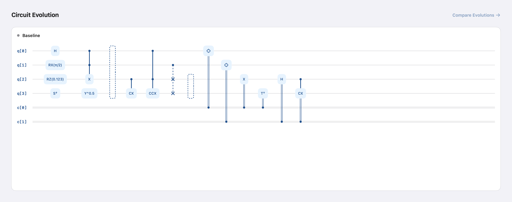
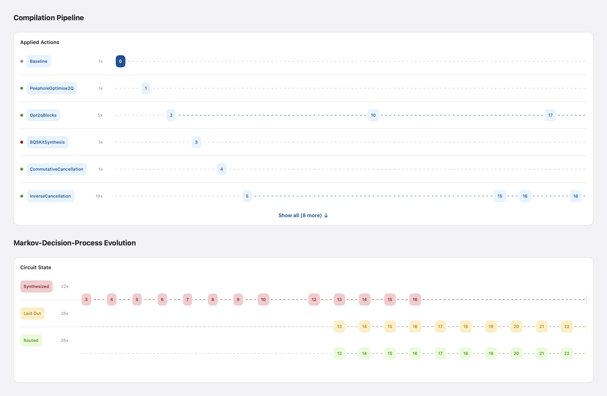

# Application Walkthrough

MQT FlowViz turns a compilation trace generated by
[MQT Predictor](https://mqt.readthedocs.io/projects/predictor/en/latest/tracing.html)
into an interactive view of the compilation process. This walkthrough uses the
[`sample.json`](../MQT_FlowViz/Resources/sample.json) trace included in the
repository.

## Importing a Trace

1. Build and run MQT FlowViz as described in the
   [installation guide](installation.md).
2. Select the **+** button in the sidebar.
3. Choose a compatible JSON trace, such as
   `MQT_FlowViz/Resources/sample.json`.
4. Select the imported compilation in the sidebar.

Use the step control in the toolbar to move through the compilation. The arrow
buttons and the left and right arrow keys select the previous or next step. You
can also enter a step number directly. The selected step is shared by the
circuit and timeline views.

## Compilation Overview

The overview summarizes the complete compilation run in three cards:

- **Results** shows the target device and the final circuit metrics.
- **Deltas** compares the initial and final numbers of qubits, gates, depth,
  multi-qubit gates, and swaps.
- **Metas** reports the selected policy, action count, duration, and most
  expensive action.

Use this section for a quick assessment of the compilation outcome before
inspecting individual steps.

## Compilation Information

The metric charts show how parallelism, entanglement ratio, liveness, used
qubits, reward, and critical depth change throughout the run. Select a point on
a chart to inspect its value at that step. Charts with more than eight steps
can be scrolled horizontally.

The **Figures of Merit** chart compares the available quality metrics. Its
symbols distinguish exact, approximate, and unavailable values.

## Circuit Evolution

The circuit view renders the OpenQASM 3 representation stored at the selected
step. The heading and colored status mark identify the action that produced the
current circuit.

Select **Compare Evolutions** to inspect two steps together. The comparison view
supports horizontal and vertical layouts. Enable the link control to advance
both circuits by the same number of steps.

## Compilation Pipeline and MDP Evolution

The **Compilation Pipeline** groups compiler actions by name and places every
invocation on the shared step axis. Select a numbered step to update the circuit
view. Expand the card to display actions beyond the initial set.

The **Markov-Decision-Process Evolution** shows when the circuit is synthesized,
laid out, and routed. Together, both timelines connect compiler actions to the
corresponding circuit states.

## Exporting a Trace

Select the share button in the toolbar to export the currently selected trace
as JSON. The exported file can be opened in another FlowViz installation or
shared for further analysis.
